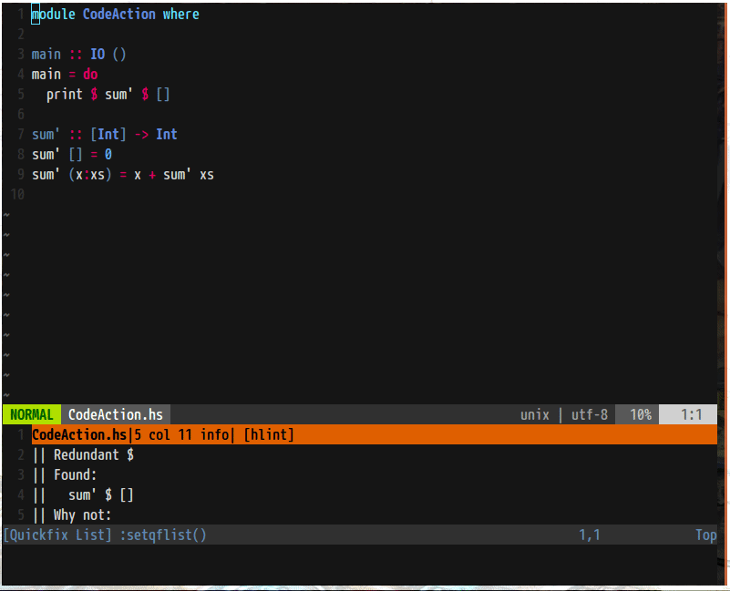
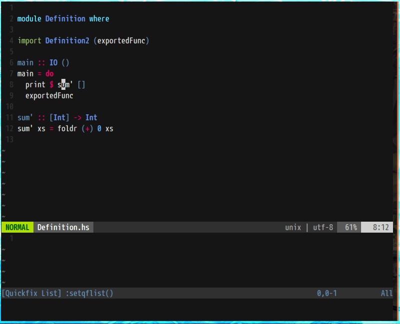
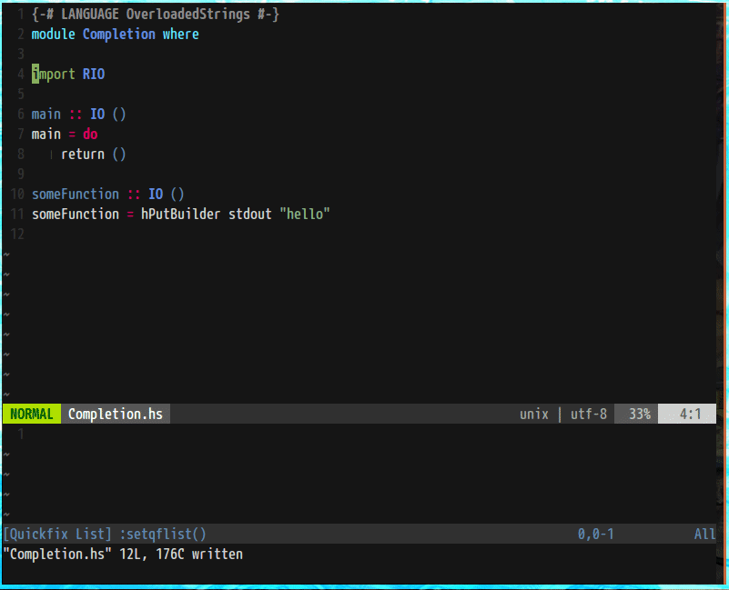

# nvim-hs-lsp

[Language Server Protcol](https://microsoft.github.io/language-server-protocol/specification) implementation for neovim using [nvim-hs](https://github.com/neovimhaskell/nvim-hs).

## Progress

Implemented most functionality

+ Diagnostics
+ Completion
+ Jump to Definition
+ Code action
+ Hover etc.

## Screen shots

### Code action

### Jump to definition

### Completion

